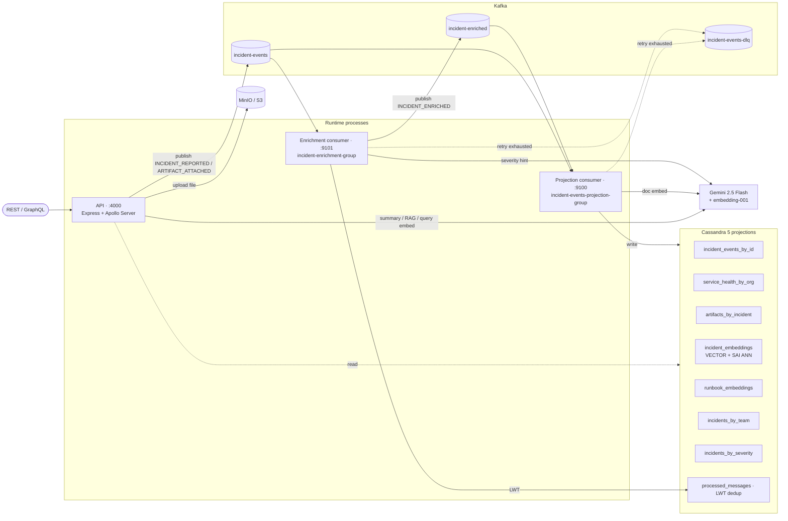

# AI Incident Intelligence

An event-sourced incident intelligence platform built around Kafka, Cassandra, MinIO, and GraphQL, with a Gemini-backed AI triage layer (structured summaries, vector-based similar-incident retrieval, and runbook-RAG next-action recommendations). The write path produces events to Kafka — the source of truth — and two independent consumer groups project those events into query-shaped Cassandra tables. Apollo Server serves the read side over GraphQL and a small REST surface.

This is a portfolio / learning project. The patterns (CQRS-style projections, idempotent consumers with DLQ + replay, compound-partition-keyed query tables, vector ANN over Cassandra 5) are the kind you'd want in production; the local-dev wiring (single-partition topics, RF=1, MinIO instead of real S3, no auth) is not.

## Architecture



Kafka is the source of truth. All projections are eventually consistent — an event published by the API will not appear in `incidentTimeline` (or any other read) until the consumer has processed it.

## What's built

- **Write path**: REST `POST /incidents` and GraphQL `createIncident` build an `INCIDENT_REPORTED` event keyed by `incidentId` and publish it to Kafka. `POST /artifacts/upload` stores files in MinIO and publishes `ARTIFACT_ATTACHED`.
- **Projection consumer** (`incident-events-projection-group`): subscribes to `incident-events` *and* `incident-enriched`, projects into `incident_events_by_id`, `service_health_by_org`, `artifacts_by_incident`, `incidents_by_team`, `incidents_by_severity`. Also writes a 768-dim Gemini embedding into `incident_embeddings` for each new `INCIDENT_REPORTED` (best-effort: a Gemini outage logs and skips, never blocks the projection).
- **Enrichment consumer** (`incident-enrichment-group`): a second, independent consumer group on `incident-events`. Computes `teamId` (`services/api/teams.js`), normalizes `severityBucket`, derives `dayBucket`, optionally calls Gemini for an `aiSeverityHint`, and emits `INCIDENT_ENRICHED` to a separate topic. An enrichment failure cannot block the core projection.
- **AI layer**:
  - `Query.incidentSummary` / `POST /ai/incident-summary` — Gemini structured-JSON output (summary, customer impact, likely root cause, confidence, next actions, signals).
  - `Query.similarIncidents` / `POST /ai/similar-incidents` — Cassandra 5 SAI ANN cosine search over `incident_embeddings`.
  - `Query.recommendedActions` / `POST /ai/recommended-actions` — RAG over similar incidents + a 7-runbook corpus (`services/api/runbooks/`, indexed via `npm run index-runbooks`).
- **Reliability**: per-group LWT-backed dedup in `processed_messages`, retry-with-linear-backoff (3 attempts), DLQ on exhaustion or malformed JSON, and a replay tool (`npm run replay-dlq`). Projection and enrichment DLQ payloads carry `failedConsumerGroup` so triage is straightforward.
- **Observability**: pino structured logs with per-message `incidentId` / `eventId` / `topic` / `partition` / `offset` correlation; `pino-http` for per-request `reqId`; Prometheus metrics on three ports (`:4000/metrics`, `:9100/metrics`, `:9101/metrics`) including `events_published_total`, `events_consumed_total`, `events_dlq_total`, `event_processing_duration_seconds`, `event_end_to_end_lag_seconds`, and a partition-aware `kafka_consumer_lag_messages` gauge refreshed every 10s.
- **Tests**: one Jest integration test against the compose harness (`services/api/test/integration/projection.test.js`) — projects `INCIDENT_REPORTED` and exercises the `FORCE_DLQ` path. Five smoke scripts cover the rest end-to-end manually.

See [`ROADMAP.md`](ROADMAP.md) for what's next.

## Quick start

Prereqs: Docker, Node 18+, (optional) a Gemini API key for the AI endpoints.

```bash
# 1. Bring up Kafka, Cassandra, Kafka UI, and MinIO
docker compose up -d

# 2. Apply the schema (idempotent)
docker exec -i aii-cassandra cqlsh < schema.cql

# 3. Configure (the only required vars are KAFKA_BROKERS and CASSANDRA_CONTACT_POINTS,
#    which already match the compose defaults; set GEMINI_API_KEY here if you have one)
cd services/api
cp .env.example .env

# 4. Install
npm install

# 5. Index the seed runbooks (only needed once, and only if GEMINI_API_KEY is set)
npm run index-runbooks

# 6. Start the three runtime processes in three terminals
npm start                       # API + GraphQL on :4000
npm run consumer                # projection consumer
npm run enrichment-consumer     # enrichment consumer
```

Kafka UI is at `http://localhost:18088`.

## Try it

### One-shot end-to-end demo

```bash
npm run demo
```

Posts a single payments-api incident, polls until the projection consumer and enrichment consumer have caught up, then exercises all three AI endpoints. Annotated terminal output, ~5–10s on a warm stack. Skips the AI steps cleanly if `GEMINI_API_KEY` is unset.

### Apollo Sandbox

Open `http://localhost:4000/graphql` in a browser. Apollo Server serves Sandbox by default in dev — it gives you the full schema, type-aware autocomplete, and a query history. Copy-pasteable starter queries are in [`services/api/SAMPLE_QUERIES.md`](services/api/SAMPLE_QUERIES.md).

### REST

```bash
# Create an incident
curl -s http://localhost:4000/incidents \
  -H 'content-type: application/json' \
  -d '{
    "incidentId": "manual-1",
    "orgId": "demo-org",
    "serviceName": "payments-api",
    "severity": "CRITICAL",
    "message": "Payments API timing out after deploy."
  }'

# Generate a structured summary (after the projection consumer has caught up)
curl -s http://localhost:4000/ai/incident-summary \
  -H 'content-type: application/json' \
  -d '{"incidentId":"manual-1","orgId":"demo-org"}'
```

## Project layout

```
services/api/
  index.js                       # Express + Apollo Server, REST + GraphQL
  consumer.js                    # projection consumer (idempotent + retry + DLQ)
  enrichment-consumer.js         # enrichment consumer (independent group)
  cassandra.js                   # all DB read + write helpers
  kafka.js                       # producer + topic ensure
  minio.js                       # artifact upload + signed URLs
  gemini.js                      # structured summary
  embeddings.js                  # query / document embedding wrappers
  retrieval.js                   # similar-incident ANN
  recommendations.js             # runbook RAG
  index-runbooks.js              # batch tool: runbooks/*.md → runbook_embeddings
  config.js                      # frozen, fail-fast env config
  logger.js                      # pino with per-service / per-message children
  metrics.js                     # prom-client + partition-aware lag gauge
  prompts/                       # incident-summary + recommended-actions templates
  runbooks/                      # 7 seed markdown runbooks with YAML front-matter
  test/integration/              # Jest integration test against the compose harness
  smoke-*.js                     # manual end-to-end smokes per AI feature
  demo.js                        # the `npm run demo` entry point
schema.cql                       # Cassandra DDL — keyspace + 8 tables
docker-compose.yml               # Kafka (KRaft) + Cassandra + Kafka UI + MinIO
```

## Notable design choices

- **Two consumer groups, one topic.** Projection and enrichment subscribe to `incident-events` independently so an enrichment outage cannot block the core read path. Each group has its own `processed_messages` partition.
- **Compound partition key on `incidents_by_severity`** — `(severity_bucket, day_bucket)` — so the `CRITICAL` bucket cannot grow into an unbounded partition.
- **Best-effort embedding inside the projection consumer.** The embedding write happens after the core projection lands; failures are logged and swallowed. The system runs fine without `GEMINI_API_KEY`; only AI features go dark. Trade-off: incidents created during a Gemini outage are missing from `incident_embeddings` until a backfill runs (backfill CLI is the next item on the roadmap).
- **Substring-safe DLQ test hooks.** `FORCE_DLQ` triggers the projection-consumer DLQ path; `BREAK_ENRICH` does the same for enrichment. The two sentinels are deliberately disjoint as substrings — naming the enrichment hook `FORCE_DLQ_ENRICH` would have crossed the projection consumer's `includes("FORCE_DLQ")` check.

## License

Private project; not licensed for redistribution.
